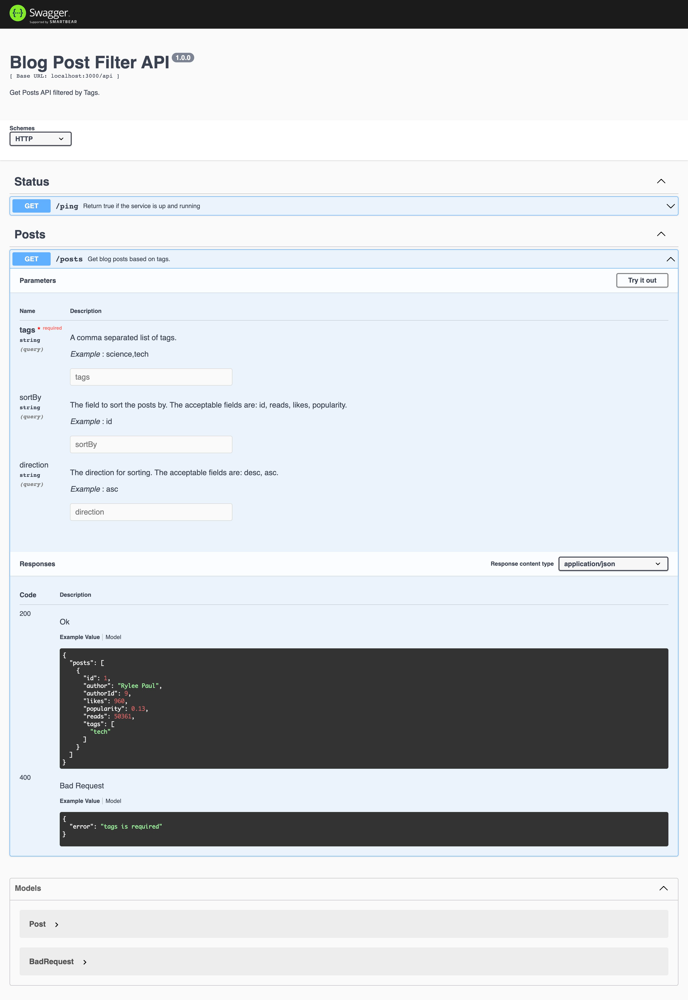

# Blog Post Filter API

API which filters blog posts by Tags.  

## Requirements

- Node >= 14.x
## Installation 


To install from GitHub, clone the repository and install dependencies using `npm`:

```sh
$ git clone https://github.com/Shenoudafarouk/Blog-Post-Filter.git
$ cd Blog-Post-Filter
$ npm install
```
you need typescript installed globally to run this command to build the app
```sh
$ npm run build-ts
```

Lastly, start the application with:
```sh
$ npm start
```

Swagger API documentation
-----------------


to open Swagger API documentation just browse to 

    http://localhost:3000/api-docs

## Running Tests

To run tests, run the following command

```bash
  npm test
```

